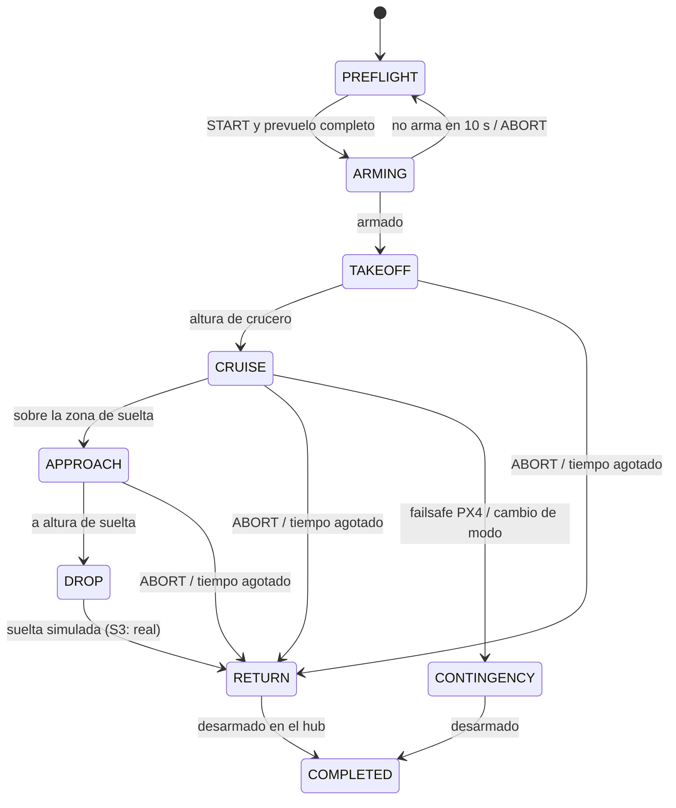

# Hito S2 — gestión de misión

> Los paquetes (`drone_core`, `drone_interfaces`, `drone_mission`) y los ficheros `ops/` y `missions/` viven en el repo `drone-ros`; aquí quedan la simulación y los scripts de prueba.

Objetivo (DOC-10 §8): `mission_manager` y `config_manager` con el mundo plano de Toulouse. Habilita SIM-01 (sin suelta real hasta S3), SIM-19 (toma de control del piloto) y SIM-20 (otra ciudad).

## Paquetes nuevos

| Paquete | Qué es | Depende de ROS |
| --- | --- | --- |
| `drone_core` | Librería C++: geodesia (NED↔ENU en un único sitio), geometría, configuración por ciudad (YAML + GeoJSON), validación de misiones, CRC32 y hash de zona para `DG_ZONE_HASH`. Incluye la herramienta `drone_validate` | No (se compila también con CMake puro) |
| `drone_interfaces` | Mensajes, servicios y acción del ICD: MissionState, ActiveConfig, PayloadState, HealthStatus, EnergyEstimate, MissionCommand, DropPayload | Sí |
| `drone_mission` | `MissionStateMachine` (C++ puro) + nodos `config_manager` y `mission_manager` + launch `s2.launch.py` | Solo los nodos |

## Ficheros de operación

| Fichero | Contenido |
| --- | --- |
| `ops/toulouse.yaml` + `.geojson` | Hub provisional, volúmenes operacional y de contingencia (~5,5 km), corredor, zona de suelta `tls_dz_01`, zona prohibida y zona con autorización **de ejemplo**, punto de emergencia |
| `ops/donostia.yaml` + `.geojson` | Igual para Donostia |
| `missions/tls_demo_01.yaml` | Hub → waypoint al norte → `tls_dz_01` (1,5 km de ida, 2,7 km en total) |
| `missions/dss_demo_01.yaml` | Hub → `dss_dz_01` en línea recta (0,8 km de ida) |

Las zonas de ejemplo **no son espacio aéreo real**. Antes de fijar el hub en Blagnac hay que dibujarlas con Geoportail.

Validar una ciudad y una misión sin arrancar nada:

```bash
ros2 run drone_core drone_validate "$OPS_DIR" toulouse "$MISSIONS_DIR" tls_demo_01
```

## Cómo vuela una misión



- **Órdenes a PX4 por DDS:** armar, `NAV_TAKEOFF`, `DO_REPOSITION` (ir a un punto en modo Hold) y `NAV_RETURN_TO_LAUNCH`. PX4 vuela siempre en sus modos automáticos; no se usa Offboard.
- **Si el companion se cae** en crucero, PX4 se queda en Hold sobre el último punto y actúan sus failsafes (batería, enlace). En S4 se añadirá un failsafe específico de pérdida del companion.
- **Crucero a altura constante:** el descenso a la banda de suelta solo empieza en la vertical de la zona.
- **ADR-001 y AR-017:** la máquina pasa a CONTINGENCY y deja de mandar órdenes si PX4 entra en failsafe, si alguien cambia el modo durante más de 3 s, o si la **consigna de PX4** (`position_setpoint_triplet`) deja de coincidir con el objetivo durante más de 1 s. Esto último es lo que detecta la **Pausa** de QGroundControl, que no cambia de modo (sigue en Hold).
- **GOTO confirmado:** la orden de ir a un punto se envía una vez por tramo y se da por aceptada cuando la consigna de PX4 coincide; si no, se reintenta hasta 3 veces y después CONTINGENCY.
- **Home de PX4:** `home_position` solo se publica cuando cambia, y puede perderse si el agente DDS conecta tarde. Por eso no se exige antes de iniciar: se espera al armar, que es cuando PX4 lo vuelve a fijar.
- **Coherencia de configuración:** `mission_manager` carga la misma ciudad y compara su hash con el que publica `config_manager`. Si no coinciden, no deja iniciar.

## Probar en nativo

En cada terminal: `source env_native.sh` (ver `README_NATIVE.md`).

```bash
# Terminal A
./scripts/start_sim.sh toulouse

# Terminal B
cd ros2_ws && colcon build --symlink-install --packages-up-to drone_mission && source install/setup.bash
ros2 launch drone_mission s2.launch.py city:=toulouse mission_id:=tls_demo_01

# Terminal C
ros2 topic echo /drone/mission/state --field state_name        # esperar a PREFLIGHT con ready_to_start
ros2 service call /mission_manager/command drone_interfaces/srv/MissionCommand "{command: 1}"   # START
ros2 service call /mission_manager/command drone_interfaces/srv/MissionCommand "{command: 2}"   # ABORT
```

SIM-19: durante el crucero, cambia a modo Posición o Hold en QGroundControl → `CONTINGENCY`.
SIM-20: `start_sim.sh donostia` + `s2.launch.py city:=donostia mission_id:=dss_demo_01`.

## Verificación realizada (25/09/2026)

Con ROS 2 Jazzy compilado desde el código fuente, PX4 v1.17.0 SITL (simulador SIH, sin Gazebo) y el agente Micro XRCE-DDS v2.4.3:

| Prueba | Resultado |
| --- | --- |
| Compilación con `-Werror` (drone_core, drone_interfaces, drone_mission, px4_msgs 1.17) | Sin errores ni avisos |
| Tests unitarios (`colcon test`) | 64/64 (drone_core 35, drone_mission 29) |
| Cobertura de sentencias | drone_core 99 % y MissionStateMachine 99 %; lo que falta son `default` defensivos de `switch` y llaves de cierre que gcov marca por optimización |
| SIM-01 Toulouse, misión completa | PASA (6 min 40 s a 12 m/s) |
| SIM-19 Pausa del piloto en crucero | PASA: CONTINGENCY en 1,2 s; el dron se queda quieto (0 m en 10 s) |
| SIM-19 RTL del piloto en crucero | PASA: CONTINGENCY en 1,4 s |
| SIM-20 Donostia sin cambiar código | PASA |

Ejecutor automático: `scripts/s2_scenarios.py {sim01|sim19_pause|sim19_rtl|sim20}` (con la simulación y los nodos ya arrancados).

## Desviaciones respecto a DOC-10 / DOC-05 (a revisar)

| Tema | Plan original | En S2 | Motivo |
| --- | --- | --- | --- |
| Carga de misión y geofence en PX4 | Protocolo de misión por MAVLink (MAVSDK) | Tramos con `DO_REPOSITION` por DDS; geofence de PX4 aún sin cargar | Evita MAVLink en S2; SR-MSN-003 queda para S4 |
| Nodos lifecycle | Todos | Nodos normales | Se pasan a lifecycle con `health_monitor` en S4 |
| Comprobación de energía (SR-MSN-004) | Modelo de energía | Límite de longitud `max_route_m` | El modelo llega en S6 |
